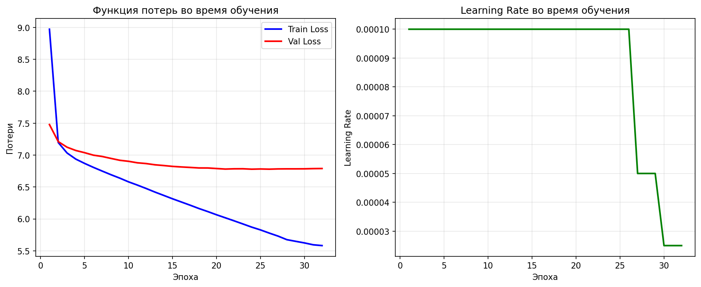
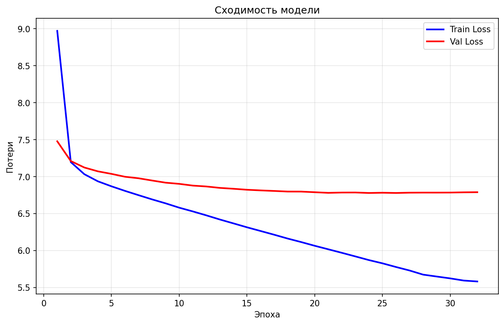

# 🤖 Russian Question-Answering Transformer

## 📋 Описание проекта

Этот проект представляет собой реализацию архитектуры трансформера для задачи вопросно-ответного диалога на русском языке на базе **PyTorch**. Модель обучена на русскоязычном диалоговом датасете и работает как чат-бот: принимает на вход вопрос и генерирует ответ.

### 🎯 Особенности проекта

- **PyTorch 2.x** - современный фреймворк для глубокого обучения
- **CUDA 12.1** - поддержка GPU для ускорения обучения (NVIDIA RTX 4060 Ti 16GB)
- **HuggingFace** - интеграция с экосистемой (datasets, tokenizers, transformers)
- **Русский язык** - специализация на русскоязычных диалогах

### 🔬 Архитектура трансформера

Трансформер состоит из двух основных компонентов: **Кодировщика (Encoder)** и **Декодировщика (Decoder)**.

#### 🏗️ Кодировщик (Encoder)

Кодировщик обрабатывает входную последовательность (вопрос) и создает её контекстное представление.


**Структура кодировщика:**
- **Positional Embedding** - добавляет информацию о позиции каждого токена
- **Multi-Head Attention** - механизм внимания для взаимодействия токенов между собой
- **Feed Forward Network** - полносвязная сеть для обработки признаков
- **Layer Normalization** - нормализация для стабильного обучения
- **Residual Connections** - остаточные связи для лучшего градиентного потока

#### 🏗️ Слой кодировщика (Encoder Layer)

Каждый слой кодировщика содержит два подслоя:


1. **Multi-Head Self-Attention** - каждый токен "внимает" всем остальным токенам в последовательности
2. **Feed Forward Network** - нелинейная трансформация признаков

#### 🏗️ Декодировщик (Decoder)

Декодировщик генерирует ответ пошагово, используя контекст от кодировщика.


**Структура декодировщика:**
- **Positional Embedding** - позиционное кодирование для генерируемой последовательности
- **Causal Self-Attention** - маскированное внимание (токен может "внимать" только предыдущим токенам)
- **Cross-Attention** - внимание к выходу кодировщика
- **Feed Forward Network** - обработка признаков

#### 🏗️ Слой декодировщика (Decoder Layer)

Каждый слой декодировщика содержит три подслоя:


1. **Causal Self-Attention** - маскированное внимание для генерации последовательности
2. **Cross-Attention** - внимание к контексту кодировщика
3. **Feed Forward Network** - нелинейная трансформация

## 📁 Структура проекта

```
transformer-for-russian-qa/
├── README.md                          # Документация проекта
├── requirements.txt                   # Зависимости проекта
├── .gitignore                        # Игнорируемые файлы
│
├── src/                              # Исходный код
│   ├── __init__.py
│   ├── config.py                     # Конфигурация и гиперпараметры
│   ├── gpu_config.py                 # Настройка GPU и CUDA
│   │
│   ├── data/                         # Работа с данными
│   │   ├── __init__.py
│   │   ├── dataset.py                # Оригинальный датасет (TensorFlow)
│   │   ├── dataset_pytorch.py        # PyTorch датасет с HuggingFace
│   │   ├── tokenizer.py              # Оригинальный токенизатор
│   │   └── tokenizer_pytorch.py      # HuggingFace токенизатор
│   │
│   ├── models/                       # Модели трансформера
│   │   ├── __init__.py
│   │   ├── attention.py              # Слои внимания
│   │   ├── encoder.py                # Кодировщик
│   │   ├── decoder.py                # Декодировщик
│   │   ├── transformer.py            # Полная архитектура трансформера
│   │   └── positional_encoding.py    # Позиционное кодирование
│   │
│   ├── training/                     # Обучение модели
│   │   ├── __init__.py
│   │   ├── optimizer.py              # Оптимизатор и расписание LR
│   │   ├── loss.py                   # Функции потерь
│   │   └── metrics.py                # Метрики
│   │
│   ├── inference/                    # Инференс и чат-бот
│   │   ├── __init__.py
│   │   ├── chat_bot.py               # Класс чат-бота (TensorFlow)
│   │   └── chat_bot_pytorch.py       # Класс чат-бота (PyTorch)
│   │
│   └── visualization/                # Визуализация
│       ├── __init__.py
│       └── attention_viz.py          # Визуализация весов внимания
│
├── notebooks/                        # Jupyter notebooks для экспериментов
│   └── train.ipynb                   # Ноутбук для обучения
│
├── docs/                             # Документация
│   ├── images/                       # Изображения архитектуры
│   │   ├── Encoder.png
│   │   ├── EncoderLayer.png
│   │   ├── Decoder.png
│   │   └── DecoderLayer.png
│   └── architecture.md               # Подробное описание архитектуры
│
├── data/                             # Данные (создается при запуске)
│   ├── raw/                          # Исходные данные
│   ├── processed/                    # Обработанные данные
│   └── vocab/                        # Словари токенизатора
│
├── models/                           # Сохраненные модели (создается при запуске)
│   ├── best_transformer_pytorch.pth  # Лучшая модель PyTorch
│   ├── final_transformer_pytorch.pth # Финальная модель PyTorch
│   └── checkpoint_epoch_*.pth        # Чекпоинты обучения
│
├── outputs/                          # Результаты экспериментов
│   ├── logs/                         # Логи обучения
│   ├── plots/                        # Графики обучения
│   └── attention_maps/               # Карты внимания
│
├── scripts/                          # Скрипты
│   ├── train.py                      # Обучение модели (PyTorch)
│   ├── train_simple.py               # Простой пример обучения (PyTorch)
│   ├── chat.py                       # Запуск чат-бота (PyTorch)
│   └── visualize.py                  # Визуализация
│
├── train_pytorch_full.py             # Полный скрипт обучения PyTorch (альтернатива)
├── train_pytorch_simple.py           # Простой тестовый скрипт PyTorch (устаревший)
├── check_cuda.py                     # Проверка CUDA и GPU
└── example_gpu_usage.py              # Пример использования GPU
```

## 🚀 Быстрый старт

### 1. Установка зависимостей

#### Установка PyTorch с CUDA 12.1:
```bash
pip install torch torchvision torchaudio --index-url https://download.pytorch.org/whl/cu121
```

#### Установка остальных зависимостей:
```bash
pip install -r requirements.txt
```

### 2. Проверка GPU

Убедитесь, что CUDA доступна:
```bash
python check_cuda.py
```

Вывод должен показать:
```
PyTorch version: 2.5.1+cu121
CUDA available: True
CUDA version: 12.1
GPU: NVIDIA GeForce RTX 4060 Ti
GPU Memory: 16GB
```

### 3. Подготовка данных

Датасет автоматически скачивается с HuggingFace:
```python
from src.data.dataset_pytorch import load_russian_dialogues

dataset = load_russian_dialogues(max_samples=20000)
```

### 4. Обучение модели

#### Простой тест (синтетические данные):
```bash
python scripts/train_simple.py
```

#### Полное обучение (реальные данные):
```bash
python scripts/train.py
```

Или альтернативно:
```bash
python train_pytorch_full.py
```

> **💡 Важно:** При обучении модели автоматически создаются логи и графики в папке `outputs/`:
> - `outputs/logs/training.log` - подробный лог обучения
> - `outputs/logs/training_history.json` - история метрик в JSON
> - `outputs/plots/training_loss.png` - график потерь и learning rate
> - `outputs/plots/convergence.png` - график сходимости модели

### 5. Запуск чат-бота

```bash
python scripts/chat.py
```

Чат-бот загрузит обученную модель и позволит вам общаться с ней в интерактивном режиме.

## ⚙️ Гиперпараметры

Основные гиперпараметры модели (настраиваются в `src/config.py`):

| Параметр | Значение | Описание |
|----------|----------|----------|
| `VOCAB_SIZE` | 11000 | Размер словаря |
| `BATCH_SIZE` | 64 | Размер батча (для GPU 16GB) |
| `MAX_TOKENS` | 128 | Максимальная длина последовательности |
| `num_layers` | 3 | Количество слоев encoder/decoder |
| `d_model` | 128 | Размерность эмбеддингов |
| `dff` | 256 | Размерность скрытого слоя FFN |
| `num_heads` | 4 | Количество голов внимания |
| `dropout_rate` | 0.1 | Вероятность dropout |
| `EPOCHS` | 32 | Количество эпох обучения |

### GPU конфигурация

Проект оптимизирован для работы с GPU:
- **Автоматическое определение устройства** (CUDA/CPU)
- **Mixed Precision Training** - ускорение обучения
- **Gradient Accumulation** - для больших моделей
- **Мониторинг памяти GPU** - отслеживание использования

## 📊 Результаты обучения

### Графики обучения

При обучении модели автоматически генерируются графики в папке `outputs/plots/`:

#### 📊 График потерь (training_loss.png)
Содержит два подграфика:
- **Train Loss / Val Loss** - функция потерь на тренировочной и валидационной выборках
- **Learning Rate** - динамика изменения скорости обучения



#### 📈 График сходимости (convergence.png)
Показывает сходимость модели по функции потерь:



#### 📝 Логи обучения (training.log)
Подробный лог-файл с информацией о каждом шаге обучения:
- Параметры модели
- Прогресс эпох
- Значения потерь
- Learning rate
- Информация о GPU

#### 📄 История обучения (training_history.json)
JSON-файл с полной историей метрик:
```json
{
  "epoch": [1, 2, 3, ...],
  "train_loss": [2.5, 2.0, 1.5, ...],
  "val_loss": [2.6, 2.1, 1.6, ...],
  "learning_rate": [0.0001, 0.0001, 0.0001, ...]
}
```

### Карты внимания

Модель позволяет визуализировать веса внимания для каждого токена:

```python
from src.visualization.attention_viz import plot_attention_weights

plot_attention_weights(
    question="Как дела?",
    answer_tokens=answer_tokens,
    attention_weights=attention_weights
)
```

## 🎯 Примеры использования

### Пример 1: Простой вопрос

**Вопрос:** "Привет, как тебя зовут?"

**Ответ:** "Меня зовут бот. Я могу помочь вам с вопросами."

### Пример 2: Сложный вопрос

**Вопрос:** "Что такое трансформер?"

**Ответ:** "Трансформер - это архитектура нейронной сети, основанная на механизме внимания."

## 🔬 Технические детали

### Механизм внимания

Трансформер использует механизм **Multi-Head Attention**, который позволяет модели обращать внимание на разные части последовательности одновременно:

```
Attention(Q, K, V) = softmax(QK^T / √d_k) * V
```

где:
- Q (Query) - запрос
- K (Key) - ключ
- V (Value) - значение
- d_k - размерность ключа

### Позиционное кодирование

Так как трансформер не имеет встроенной информации о порядке токенов, используется позиционное кодирование:

```
PE(pos, 2i) = sin(pos / 10000^(2i/d_model))
PE(pos, 2i+1) = cos(pos / 10000^(2i/d_model))
```

### Оптимизатор

Используется **Adam** (PyTorch):

```python
optimizer = optim.Adam(model.parameters(), lr=0.0001)
```

Используется **ReduceLROnPlateau** для автоматического уменьшения learning rate при застое:

```python
scheduler = ReduceLROnPlateau(optimizer, mode='min', factor=0.5, patience=2)
```

### Функция потерь

Используется **CrossEntropyLoss** с игнорированием padding токенов:

```python
criterion = nn.CrossEntropyLoss(ignore_index=tokenizer_an.pad_token_id)
```

## 📦 Зависимости

Основные библиотеки:
- **PyTorch** >= 2.0.0 (с CUDA 12.1)
- **HuggingFace Transformers** >= 4.30.0 - токенизация и модели
- **HuggingFace Datasets** >= 2.0.0 - загрузка датасетов
- **HuggingFace Tokenizers** >= 0.13.0 - быстрая токенизация
- **matplotlib** >= 3.5.0 - визуализация
- **numpy** >= 1.21.0, <2.0 - вычисления (совместимость с PyTorch)
- **tqdm** >= 4.65.0 - прогресс-бары

### Системные требования

- **Python** >= 3.8
- **CUDA** 12.1 (для GPU)
- **GPU** с минимум 8GB памяти (рекомендуется 16GB)
- **RAM** минимум 16GB

## 🤝 Вклад в проект

Для внесения изменений:
1. Форкните репозиторий
2. Создайте ветку для новой функции
3. Внесите изменения
4. Создайте Pull Request

## 📝 Лицензия

MIT License

## 📧 Контакты

Вопросы и предложения можно направлять в Issues репозитория.

## 🙏 Благодарности

- **HuggingFace** за датасет `Den4ikAI/russian_dialogues` и экосистему инструментов
- **PyTorch** за мощный и гибкий фреймворк глубокого обучения
- **NVIDIA** за CUDA и поддержку GPU
- Авторам оригинальной статьи **"Attention Is All You Need"** (Vaswani et al., 2017)

## 🔄 История миграции

Проект был мигрирован с TensorFlow на PyTorch для:
- Лучшей совместимости с CUDA 12.1
- Более гибкой архитектуры моделей
- Интеграции с экосистемой HuggingFace
- Улучшенной производительности на GPU

## 📝 История изменений

### Обновление 08.02.2026

1. **Исправлен scripts/chat.py** - теперь использует PyTorch вместо TensorFlow
2. **Создан src/inference/chat_bot_pytorch.py** - PyTorch-версия чат-бота
3. **Обновлен scripts/train.py** - полный скрипт обучения на PyTorch
4. **Перемещен train_pytorch_simple.py** в scripts/train_simple.py
5. **Заменен scripts/train.py** на версию для PyTorch (ранее использовал TensorFlow)
6. **Модели сохранены в:**
   - `models/best_transformer_pytorch.pth` - лучшая модель
   - `models/final_transformer_pytorch.pth` - финальная модель

### Использование

- Для обучения: `python scripts/train.py` или `python train_pytorch_full.py`
- Для простого теста: `python scripts/train_simple.py`
- Для чата: `python scripts/chat.py`